# System Diagrams

Visual companions to the written docs. These use **Mermaid** — they render in
VS Code's Markdown preview (Cmd/Ctrl-Shift-V) and on GitHub. If you see raw code,
install a Mermaid preview extension or view on GitHub.

Jump to: [Architecture](#1-architecture--context) ·
[Data model](#2-data-model-er) · [Hiring flow](#3-hiring-flow-sequence) ·
[Candidate access](#4-candidate-access-sequence) ·
[Application status](#5-application-status-state-machine) ·
[Document & compliance status](#6-document--compliance-status) ·
[Compliance read path](#7-compliance-read-path-fallback) ·
[CRM sync & scheduling](#8-crm-sync--scheduling) · [Auth](#9-auth-mechanisms) ·
[Compliance migration](#10-compliance-migration)

**Compliance deep-dives:** [Unified catalog](#11-unified-document--compliance-catalog) ·
[Requirement targeting](#12-requirement-targeting) ·
[Editing staff compliance](#13-editing-a-staffs-compliance) ·
[Accept-before-sync & reconciliation](#14-accept-before-sync--reconciliation)

---

## 1) Architecture / context

How the pieces fit. One Next.js app (web + API), one Mongo mirror, and external
systems it talks to.

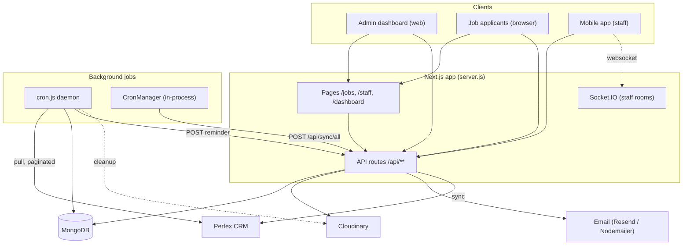

---

## 2) Data model (ER)

Key entities and how they relate. See [data-models.md](./data-models.md) for full
field lists.

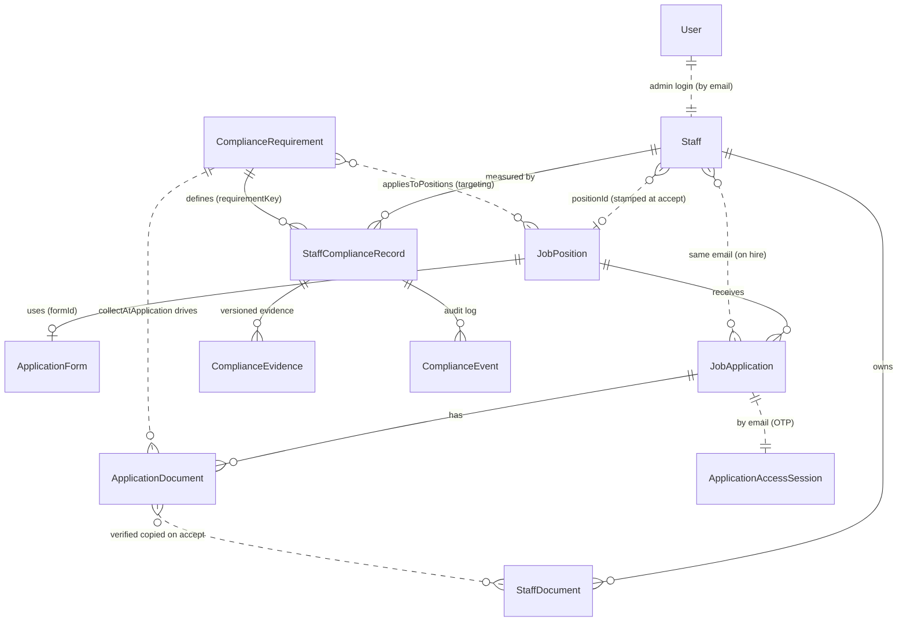

> `documentType` (on ApplicationDocument / StaffDocument) and `requirementKey`
> (on StaffComplianceRecord) are the **same dynamic key** — a
> `ComplianceRequirement.key`. There is no fixed document enum anymore.

---

## 3) Hiring flow (sequence)

From published job to hired staff. See [hiring-flow.md](./hiring-flow.md).

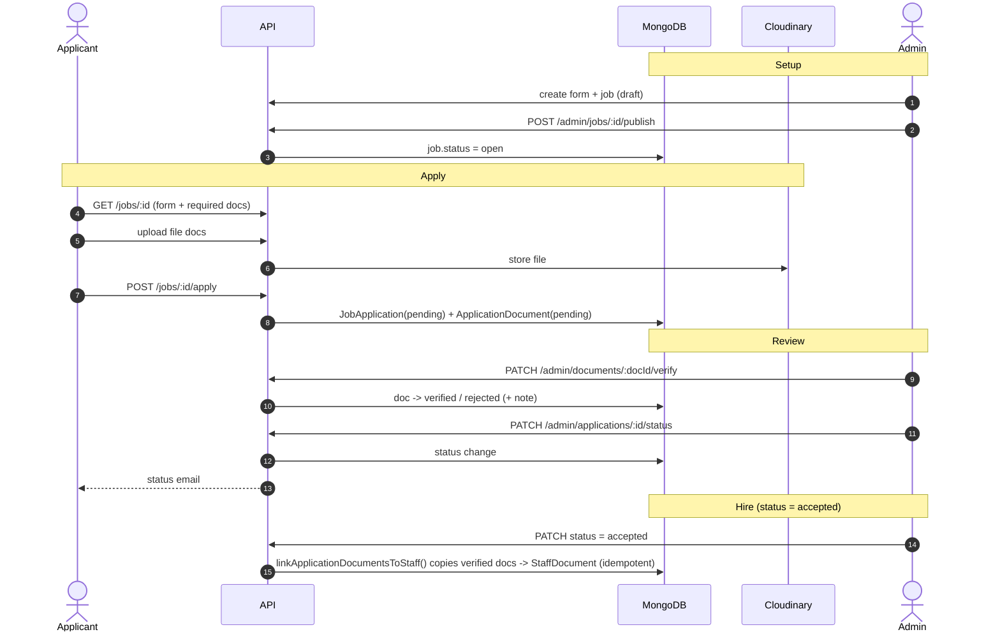

---

## 4) Candidate access (sequence)

OTP → short-lived token → track/edit. See
[candidate-tracking.md](./candidate-tracking.md).

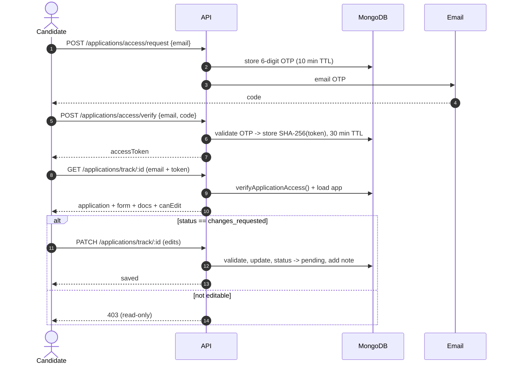

---

## 5) Application status (state machine)

`JobApplication.status` — any admin transition is allowed; only
`changes_requested` unlocks candidate edits, which return it to `pending`.

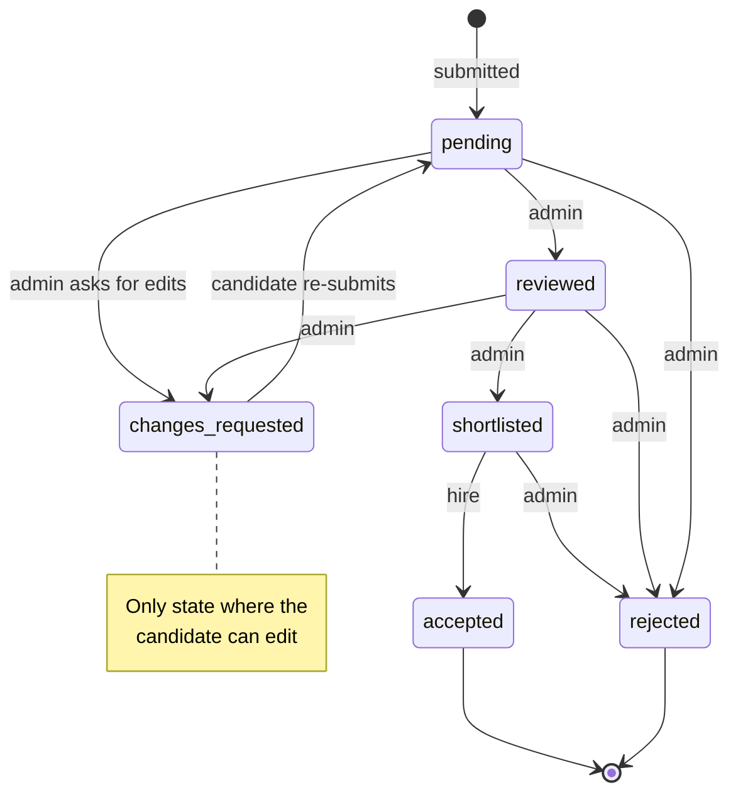

---

## 6) Document & compliance status

Two document lifecycles feed the compliance status. On hire, **verified**
`ApplicationDocument`s are copied into `StaffDocument`s.

`ApplicationDocument.status`:

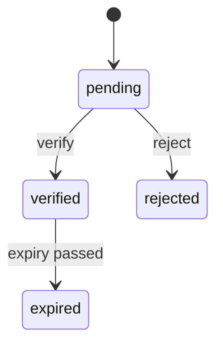

`StaffDocument.status` (created from a verified app doc on hire):

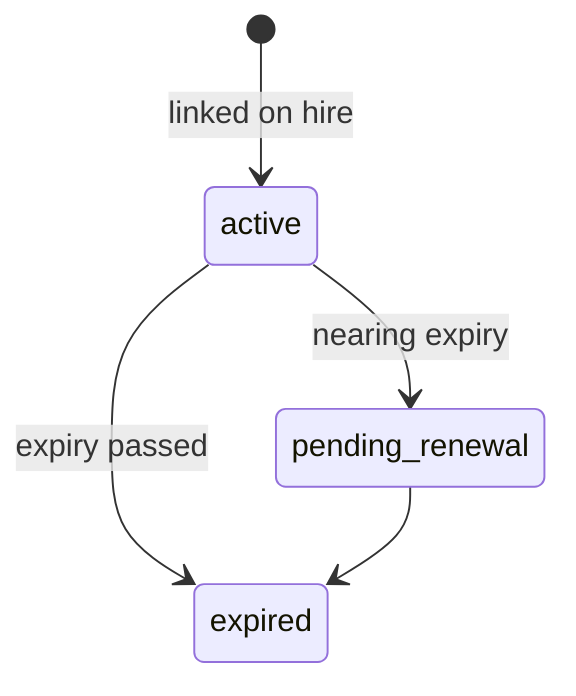

Compliance status (`StaffComplianceRecord.status`) — authoritative, with a
read-time "past expiry then expired" override:

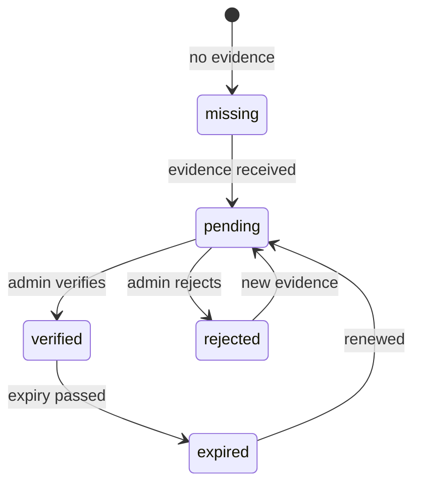

---

## 7) Compliance read path (fallback)

`buildComplianceView()` first decides **which** requirements a staff member is
measured against (targeting ∪ any they already have a record for), then resolves
each to a status card — falling back through legacy data during the migration
window. See [documents-compliance.md](./documents-compliance.md).

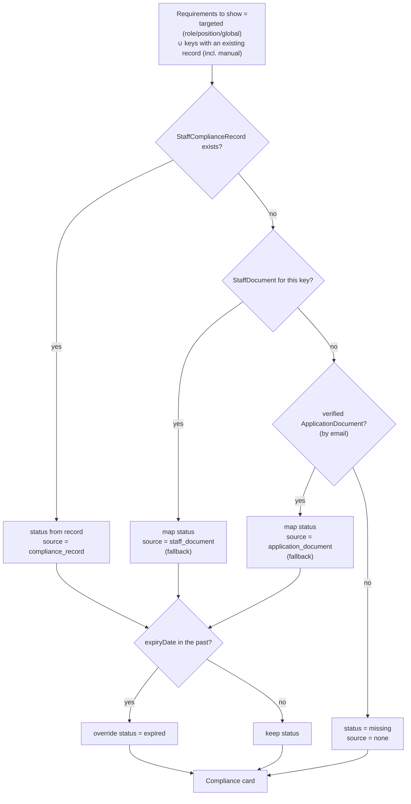

---

## 8) CRM sync & scheduling

Two schedulers; the orphan-delete safety guard is the important bit. See
[crm-sync.md](./crm-sync.md).

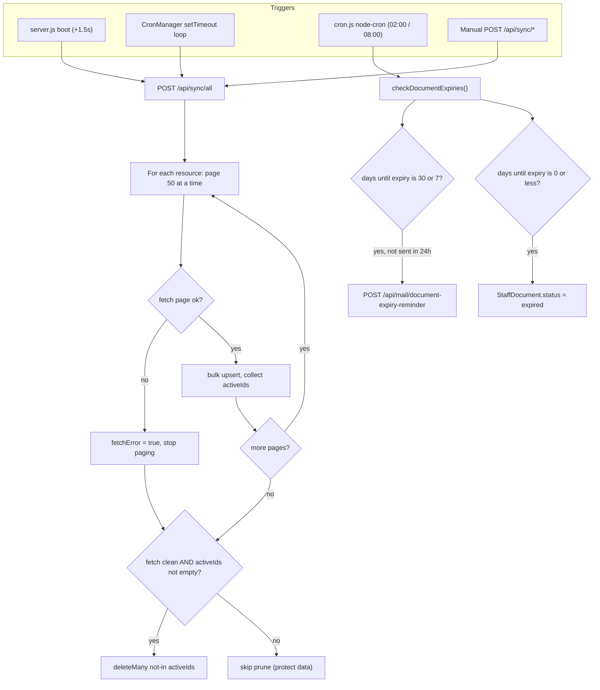

---

## 9) Auth mechanisms

Three separate paths — pick by surface. See
[auth-and-access.md](./auth-and-access.md).

```mermaid
flowchart TB
    subgraph admin["1. Admin web (NextAuth)"]
        A1["email + password"] --> A2["bcrypt vs User"]
        A2 --> A3["JWT session, role on session.user"]
        A3 --> A4["admin routes: isAdmin() guard"]
    end
    subgraph cand["2. Candidate access"]
        B1["email"] --> B2["6-digit OTP (10m)"]
        B2 --> B3["access token, SHA-256 hash (30m)"]
        B3 --> B4["track/edit: verifyApplicationAccess()"]
    end
    subgraph mob["3. Mobile staff"]
        C1["email + password"] --> C2["bcrypt vs Staff"]
        C2 --> C3["email verified? (OTP)"]
        C3 --> C4["signed JWT (30d), Bearer"]
    end
```

Registration is Perfex-gated: a web admin account can only be created for a
`Staff` row with `admin === '1'`.

---

## 10) Compliance migration

Idempotent backfill (`npm run migrate:compliance`). See
[migrations/README.md](../migrations/README.md).

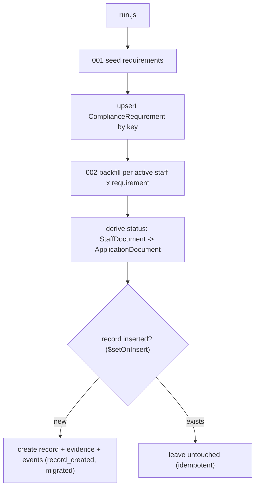

---

## 11) Unified document & compliance catalog

The `ComplianceRequirement` catalog is the **single source of truth** for every
document/credential. One requirement feeds both application intake and ongoing
compliance. General application content stays out of it.

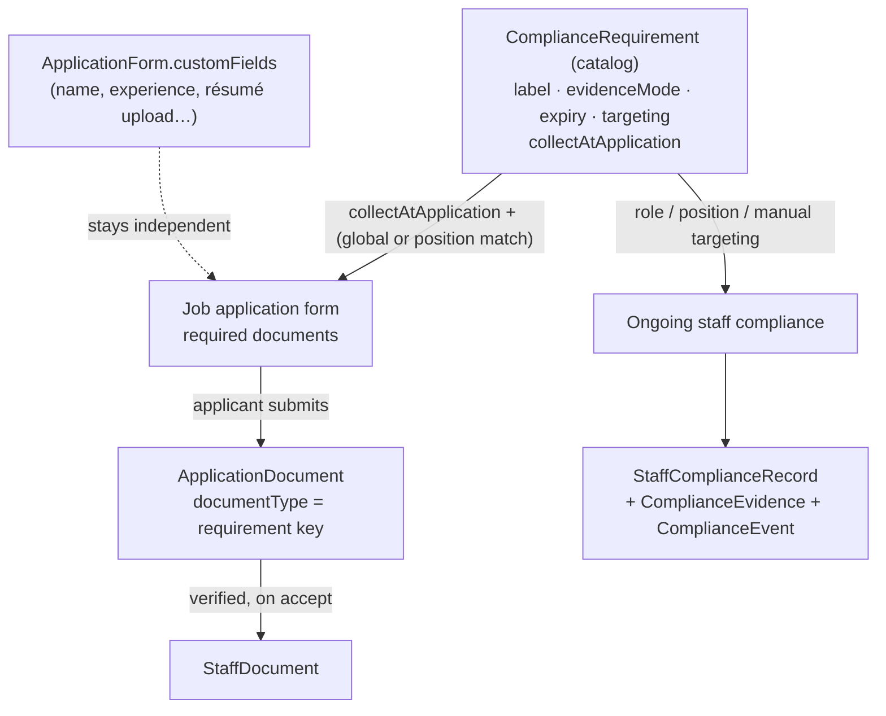

> Adding a requirement + ticking **collectAtApplication** makes it appear on the
> relevant application forms automatically — no separate document list to
> maintain. Non-compliance fields (including résumé file uploads) live in
> `customFields` and never touch the catalog.

---

## 12) Requirement targeting

Explicit / opt-in — a requirement applies to nobody unless targeted.

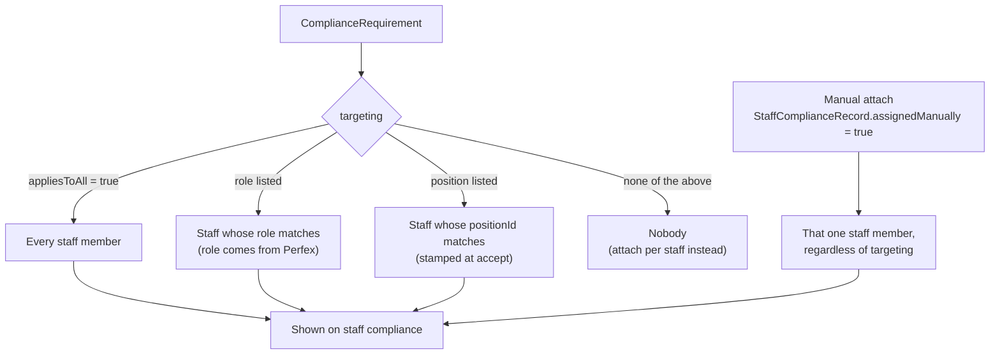

> At **application** time only *appliesToAll* and *position* targeting apply — the
> applicant has no role yet. Role targeting kicks in post-hire once Perfex sets
> the role. Built-in seeded requirements ship `appliesToAll: true`; new custom
> ones default to `false` (nobody until targeted or attached).

---

## 13) Editing a staff's compliance

The staff compliance detail modal → `POST /api/admin/compliance/staff/[staffId]/[requirementKey]`.
Every action upserts the record and appends an audit event.

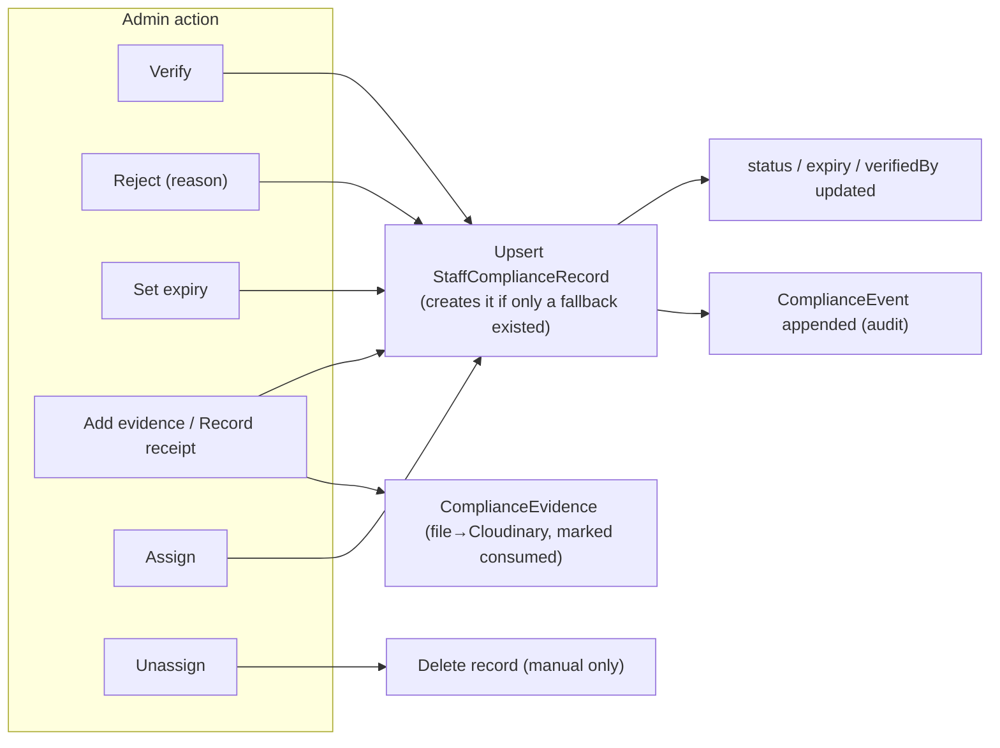

---

## 14) Accept-before-sync & reconciliation

Everything is filed under the Perfex `staffid`. If an application is accepted
**before** the person exists in Perfex, there is no id yet — data is filed under
email and self-heals on the next sync.

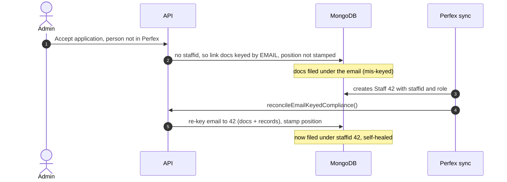

> The good ordering — **sync first, then accept** — skips all of this: the staff
> row already exists, so docs link by `staffid` and position is stamped at
> accept. Role always comes from Perfex either way.
