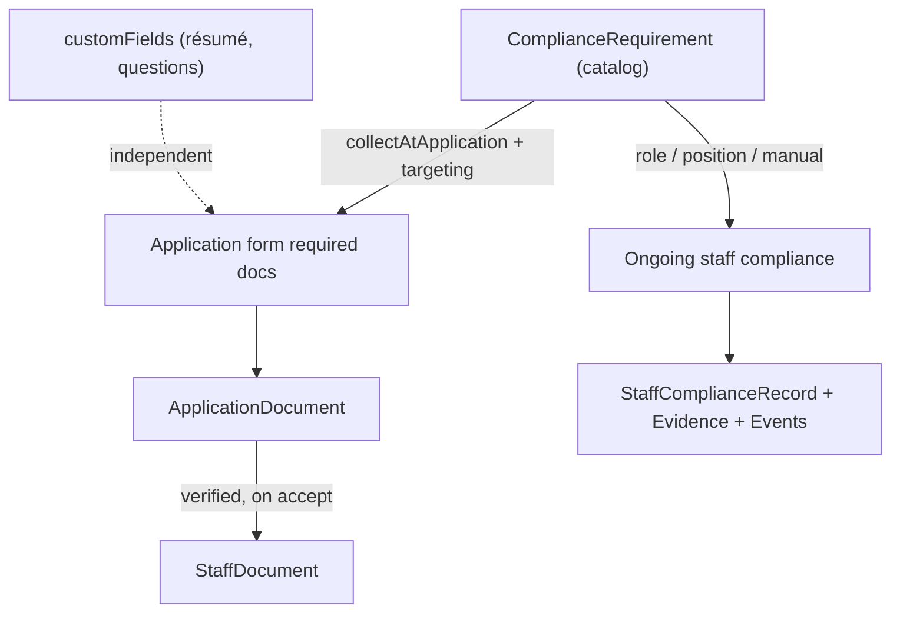
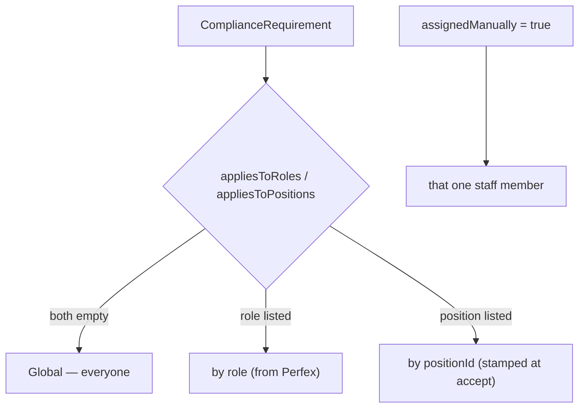
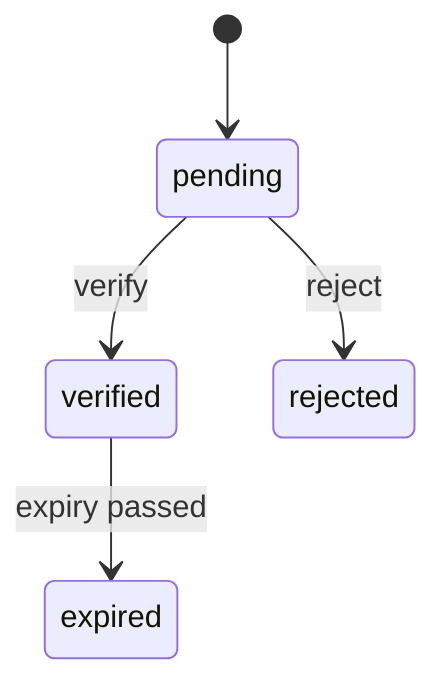
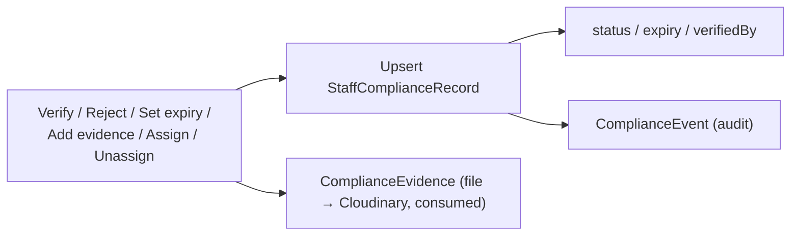
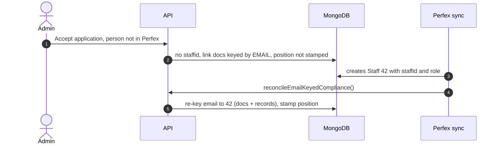

# Documents & Compliance

The compliance system is now **unified**: one catalog (`ComplianceRequirement`)
is the single source of truth for every document/credential, driving **both**
job-application intake **and** ongoing staff compliance. Document types are
dynamic (a requirement `key`), not a fixed enum.

Diagrams for everything here live in [diagrams.md](./diagrams.md) — this doc is
the narrative. See the original plan in
[handover-compliance.md](./handover-compliance.md).

---

## 1) The big picture — one catalog

- A **requirement** defines a document/credential once: `label`, `evidenceMode`
  (`file` / `metadata_only` / `either`), expiry policy, whether it's mandatory,
  **who it applies to**, and whether it's **collected at application**.
- Tick `collectAtApplication` → it shows up on the relevant application forms
  automatically. No separate document list to maintain.
- **General application content is NOT compliance.** Names, experience, and even
  non-compliance file uploads (résumé, cover letter) live in
  `ApplicationForm.customFields` and never touch the catalog.

---

## 2) Requirement targeting — who needs what

Targeting is **explicit / opt-in** — a requirement applies to a staff member only if:
- **Applies to all**: the `appliesToAll` flag is set → every staff member.
- **By role**: `Staff.role` (owned by Perfex) is in `appliesToRoles`.
- **By position**: `Staff.positionId` (stamped at accept from the hired job) is in
  `appliesToPositions`.
- **Manual**: an admin attaches a requirement to one staff member directly
  (`StaffComplianceRecord.assignedManually`) — applies regardless of targeting.

> With **none** of the above set, a requirement applies to **nobody** (it is not
> "applies to all" by default). Built-in seeded requirements ship with
> `appliesToAll: true`; new custom requirements default to `false`. Attach a
> requirement to an individual from the staff compliance detail modal
> ("Attach a requirement to this staff member").

Resolution lives in `getApplicableRequirements()` / `isTargeted()` in
`src/lib/compliance.ts`. A staff member's cards =
**targeted requirements ∪ any requirement they already have a record for** (so
manual assignments and history always surface).

> At **application** time only *global* and *position* targeting apply — the
> applicant has no role yet. Role targeting begins post-hire, once Perfex sets
> the role and the sync runs.

---

## 3) Application intake, driven by the catalog

`GET /api/jobs/[id]` and `POST /api/jobs/[id]/apply` both resolve required
documents from `getApplicationDocumentRequirements(jobId)`: active requirements
with `collectAtApplication` that are **global** or **position-targeted to that
job**. Each carries rich metadata (`label`, `requiresFile`, `storageMode`,
`requiresExpiry`) so the applicant UI renders custom document types without any
static map. The two endpoints share the resolver, so what the applicant sees and
what's validated always match.

Document types are dynamic: `ApplicationDocument.documentType` /
`StaffDocument.documentType` are free strings equal to a requirement `key`. The
old fixed enum is gone (`DOCUMENT_METADATA` remains only as the built-in seed and
a graceful fallback for the 10 legacy types).

---

## 4) The document lifecycle

- **During hiring**: `ApplicationDocument` (see [hiring-flow.md](./hiring-flow.md)).
- **On acceptance**: setting an application to `accepted` calls
  `linkApplicationDocumentsToStaff()` — copies **verified** docs into
  `StaffDocument`s (idempotent; keyed by the real `staffid`). It also stamps the
  hired position. See [hiring-flow.md](./hiring-flow.md) §6.
- **Ongoing**: `cron.js` scans `StaffDocument.expiryDate` and emails reminders at
  **30** and **7** days out; the staff detail page + compliance editing manage
  expiry (see [crm-sync.md](./crm-sync.md)).

Storage rules: sensitive IDs (SSN, State ID, Work Authorization) are
`metadata_only` — only a receipt is recorded, the file is never stored.
Renewable certifications are `file` with an expiry lifecycle.

---

## 5) Reading a staff member's compliance

`buildComplianceView({ staffId, staffEmail, role, positionId })` returns one card
per applicable requirement + a summary. Resolution order per requirement:

1. Authoritative `StaffComplianceRecord` (+ current `ComplianceEvidence`).
2. **Fallback (migration window):** legacy `StaffDocument`.
3. **Fallback:** latest verified `ApplicationDocument` (by email).
4. Otherwise `missing`.

A read-time safety marks any past-expiry card `expired`. Each card carries its
`source` (`compliance_record` / `staff_document` / `application_document` /
`none`) so authoritative vs. derived is always visible.

Exposed via `GET /api/admin/compliance/staff/[staffId]`.

---

## 6) Editing a staff member's compliance

`POST /api/admin/compliance/staff/[staffId]/[requirementKey]` with an `action`:
- **verify / reject** (reject stores a reason)
- **set_expiry** (past date auto-flips to expired)
- **add_evidence** — upload a file (Cloudinary, marked *consumed* so the cleanup
  cron won't delete it) or record a metadata-only receipt
- **assign / unassign** — manual per-staff attachment

Every action upserts the record (converting a fallback-derived card into an
authoritative record — write-time migration) and appends a `ComplianceEvent`.
Driven from the editable detail modal in the compliance dashboard.

---

## 7) Where you manage it — the compliance dashboard

Dashboard → **Compliance** tab, three sub-views:
- **Staff compliance** (default): a searchable, paginated table of staff vs. their
  status; click a row → the editable detail modal (§6).
- **Requirements**: the catalog config — add/edit requirements, set
  `collectAtApplication`, role/position targeting, evidence mode, expiry, and
  **retention period**.
- **Retention**: archived (terminated) staff and their retention state; preview
  and run secure disposal (per-staff or global). See [retention.md](./retention.md).

Per-staff, the `/staff/[id]` page shows a **compact status** only (overall pill +
counts) with a link into the dashboard for the full view.

---

## 8) Why we key on `staffid`, not email

Everything is filed under the Perfex `staffid` (a permanent, unique ID), not
email. Reasons:

1. **Email is mutable, `staffid` isn't.** An email change would orphan all
   records; `staffid` never changes.
2. **Email isn't unique in the schema; `staffid` is** (`required` + `unique`).
   Email is a plain optional string — unsafe as a key.
3. **Everything already reads by `staffid`** — the staff page, the unique
   `(staffId, requirementKey)` index, document lookups, and Perfex itself.

Email is used only as the **bridge** to resolve the right `staffid` when linking
an applicant to their future staff record. See the reconciliation below.

---

## 9) Accept-before-sync & reconciliation

If an application is accepted **before** the person exists in Perfex, there's no
`staffid` yet, so documents are filed under the email as a temporary key and the
position isn't stamped. `reconcileEmailKeyedCompliance()` (in
`src/lib/documentHelpers.ts`, run on every staff sync via `/api/staff/sync` and
`/api/sync/all`) finds those email-keyed leftovers, re-keys them to the real
`staffid` (honoring the unique index — merging duplicates), and back-fills the
position. Self-healing.

> **Recommended order:** create the person in Perfex first, let the sync bring
> them in, then accept — everything lines up immediately with no reconciliation
> needed. `Staff.role` always comes from Perfex either way.

---

## 10) Migration / backfill

Idempotent scripts under `migrations/` (`npm run migrate:compliance`): `001`
seeds requirements from the catalog seed; `002` backfills a `StaffComplianceRecord`
per active staff × requirement from existing documents, writing audit events.
Full detail in [`migrations/README.md`](../migrations/README.md). Note: the
dashboard also auto-seeds the requirement catalog on first open.

---

## 11) Open decisions

1. **Role source at accept** — roles are currently Perfex-owned and not set at
   acceptance. To make role-targeted requirements apply immediately, a role
   source (e.g. a role on the `JobPosition`) would be wired into the accept flow.
2. Final retention periods per requirement category.
3. Should rejected evidence be visible to all admins or only auditors?

## 12) Known follow-ups

- ✅ **JobsTab** — the form builder's interactive document picker has been
  replaced with a read-only view of the catalog's `collectAtApplication`
  requirements (documents are managed in Compliance → Requirements, attached by
  position). The form only defines questions now.
- **cron.js** standalone daemon has its own sync path not yet calling
  `reconcileEmailKeyedCompliance()` (the in-process CronManager path via
  `/api/sync/all` is covered).
- Candidate **track/edit** endpoint still resolves required docs from the form
  rather than the catalog (null-safe; works for built-ins).
