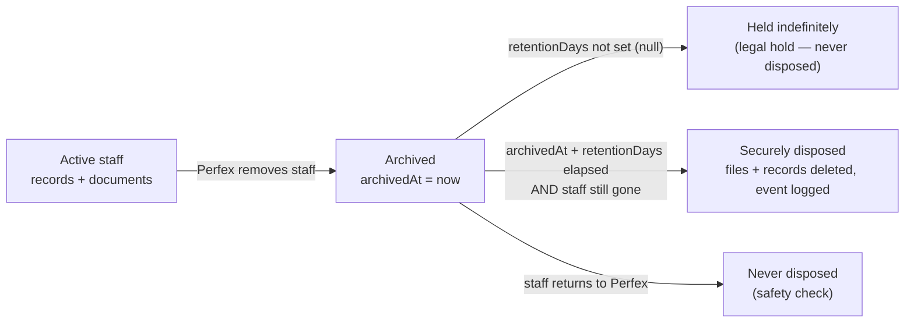

# Data Retention & Disposal

How terminated staff's compliance data is retained and securely disposed. This
is the mechanism; **the retention *periods* are a compliance/legal decision** and
default to "indefinite" until set.

> ⚠️ Not legal advice. The period suggestions below are pointers for a
> US healthcare/home-care context — confirm every number with counsel before
> enabling disposal.

---

## Lifecycle



Three moving parts:
1. **Archive** — when the Perfex sync removes a `Staff` row, we stamp
   `archivedAt` on their `StaffDocument`s and `StaffComplianceRecord`s instead of
   silently orphaning them. Nothing is deleted; the retention clock starts.
2. **Retain** — data sits archived. `ComplianceRequirement.retentionDays` sets how
   long (per requirement type). `null` = indefinite / legal hold.
3. **Dispose** — a sweep securely deletes data whose window has elapsed:
   the Cloudinary file, the evidence, and the record — writing an append-only
   `disposed` audit event.

---

## The rules (all must hold to dispose)

A record/document is disposed **only** when:
- it is **archived** (`archivedAt` set — the staff member was terminated), **and**
- its requirement has a **non-null `retentionDays`** (indefinite ⇒ never), **and**
- `archivedAt + retentionDays` is **in the past**, **and**
- the `staffId` is **not currently active** in Perfex (if they returned, we never
  dispose — a hard safety check).

Safe by default: with every requirement's `retentionDays` unset, **nothing is
ever auto-disposed**. You opt in per requirement.

---

## Where it lives

| Piece | Location |
|---|---|
| Archive on termination | `archiveTerminatedStaff()` in `src/lib/documentHelpers.ts`, called from `/api/staff/sync`, `/api/sync/all`, and `cron.js` before the staff prune |
| Retention period | `ComplianceRequirement.retentionDays` (edit in Compliance → Requirements) |
| Disposal sweep | `disposeExpiredComplianceData({ dryRun })` in `src/lib/documentHelpers.ts` |
| Secure file delete | `deleteAssetByUrl()` in `src/lib/cloudinary.ts` (parses public_id from the stored URL) |
| Trigger | `POST /api/admin/compliance/dispose` (**dry-run by default**; `{ "dryRun": false }` to delete). `GET` = preview. |

---

## The Retention dashboard

Compliance → **Retention** tab (`RetentionManager`) is the human view:
- **Summary** — archived staff, records, and how many are `held` / `pending` /
  `due` / `protected`.
- **Per staff** — every terminated staff member (shown by email + `staffid`,
  since the `Staff` row is gone), when archived, and each item's state; expand to
  see items. A **"returned to Perfex"** flag appears if the id is active again.
- **Preview cleanup** (dry-run) shows exactly what would be deleted.
- **Run cleanup** — globally (all `due`) or **per staff member** (the "Clean"
  button), with a confirm. Backed by `GET /api/admin/compliance/retention` and
  `POST /api/admin/compliance/dispose`.

## Running disposal (API)

```bash
# Preview what WOULD be disposed (safe, no deletes):
curl -X GET  /api/admin/compliance/dispose

# Dispose everything due (irreversible):
curl -X POST /api/admin/compliance/dispose -d '{"dryRun": false}'

# Dispose one terminated staff member's due data:
curl -X POST /api/admin/compliance/dispose -d '{"dryRun": false, "staffId": "42"}'
```

The response reports counts + the items considered. **Disposal is not
auto-scheduled** — it only runs when triggered (dashboard button or API). Wire it
into `cron.js` (e.g. daily, after a dry-run review period) once retention periods
are agreed.

---

## Suggested starting points (confirm with counsel)

Keyed off termination (`archivedAt`). These are *illustrative*, not authoritative:

| Requirement | Regime (US) | Rough period |
|---|---|---|
| Work Authorization (I-9) | USCIS | 1 yr after termination (or 3 yr after hire, whichever is later) |
| SSN / tax-linked | IRS | ~4 years |
| Background check evidence | FCRA | mandates **secure disposal** after use |
| Health records (TB, hepatitis, CPR/BLS…) | HIPAA / state | often ~6 years |
| License / certification | state licensing | varies |

`metadata_only` requirements (SSN, State ID, Work Authorization) store **no file**
— only a receipt — so their disposal removes just the record, not a document.

---

## What this does and doesn't do

**Does:** stop silent orphaning (archive instead), keep an audit trail
(`archived`/`disposed` events), securely delete Cloudinary files on disposal, and
protect returned staff from disposal.

**Doesn't (yet):** auto-schedule disposal; provide a per-request "right to
deletion" admin action; or enforce a *minimum* retention (it disposes *after* the
window — it does not block deletion *before* it). Those are natural follow-ups.
